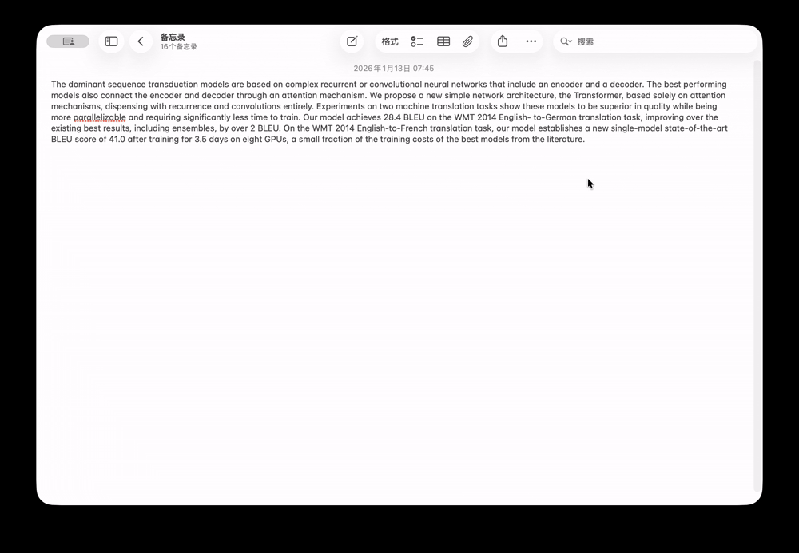
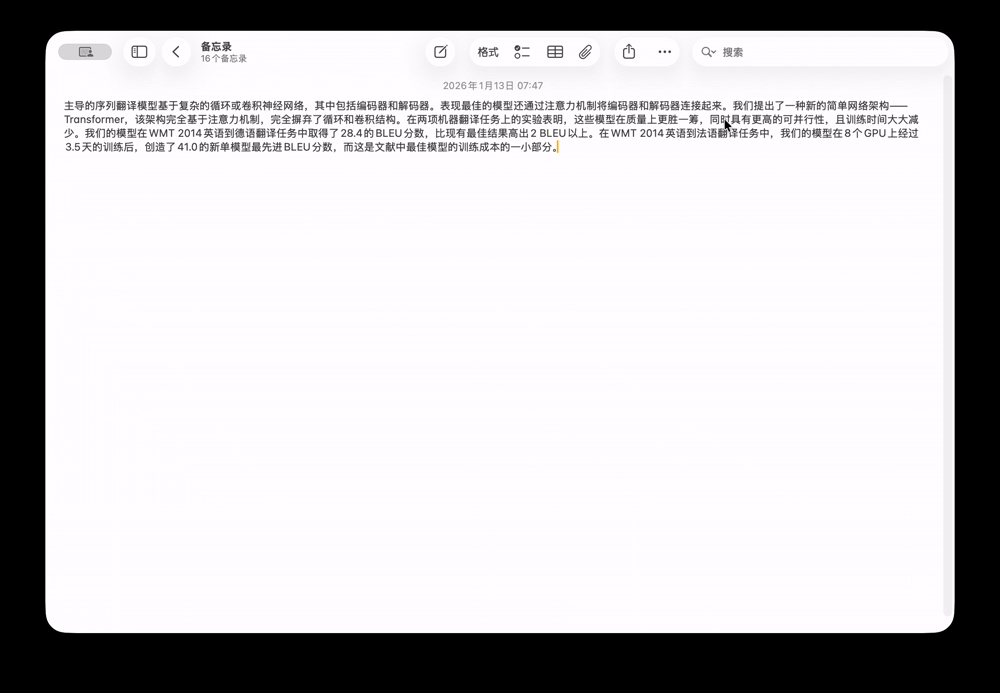

# QuickTransType-DEV

QuickTransType 是一款轻量级的输入翻译工具（开发中，当前仅支持 macOS），通过可自定义的全局热键调用 LLM 将选中或全文翻译为目标语言并自动输入到当前应用中。

## 预览




## 功能
- 通过OpenAI API接口进行翻译
- 提供翻译历史记录
- 提供MacOS系统菜单栏图标，方便访问和设置
- 提供翻译性能统计数据
- 支持自定义热键触发
- 支持翻译全部文本或选中部分文本
- 支持多种目标语言，主要取决于LLM的多语言能力
- 支持自定义翻译提示词

## 特性
- 基于 Rust 开发，资源占用极低
- 利用 LLM 进行翻译，翻译质量高，可通过自定义提示词的方式自行设定翻译风格

## 建议
推荐本地部署[腾讯混元翻译模型](https://github.com/Tencent-Hunyuan/HY-MT)作为翻译模型

***

## 自行构建
```bash
cargo tauri build
```

## 手动清除所有数据、配置
```bash
rm -rf ~/Library/Application\ Support/QuickTransType
```

## 已知问题
1. 当前**仅支持 MacOS**。
2. 热键触发不稳定。
3. 无法取消正在进行的翻译。
4. 使用可输入文本作为热键时程序会崩溃，建议使用功能键+修饰键组合作为热键。若出现崩溃，可通过手动清除配置文件的方式恢复。

## TODO
- [ ] feat: 支持 Windows
- [ ] feat: 提供取消正在进行翻译的功能
- [ ] improve: 提供多语言界面
- [ ] debug: 提高热键触发稳定性
- [ ] debug: 修复使用可输入文本作为热键时的崩溃问题

## License
This Project is licensed under the Creative Commons Attribution-NonCommercial 4.0 International License. See the [LICENSE](./LICENSE) file for details.